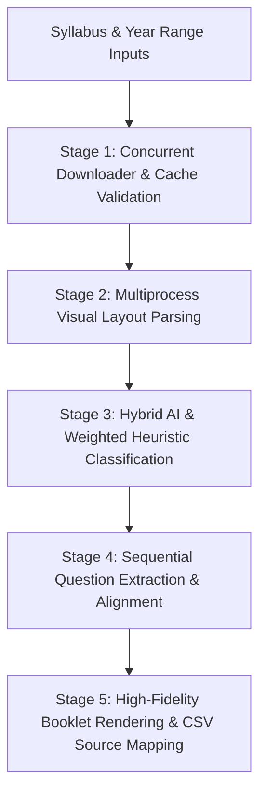

# Auraq 2.0 — High-Fidelity Topical Past Paper Compiler & Classifier

Auraq 2.0 is an enterprise-grade, high-performance compilation and classification pipeline designed to automate the curation of topical worksheets from Cambridge Assessment International Education (CAIE) past examination papers. 

By operating directly in the vector PDF space, Auraq 2.0 circumvents lossy conversions (such as PDF-to-Word/DOCX), retaining mathematical symbols, vector graphics, Cartesian coordinate grids, and complex diagrams with pixel-perfect fidelity.

---

## 🏛 Rationale & Core Problem Statement

Traditional topical past paper compilation is plagued by manual overhead and structural formatting loss:
1. **The Math/Diagram Preservation Problem:** Standard optical character recognition (OCR) and layout translation libraries scramble LaTeX-style equations, subscripts, superscripts, and geometric figures.
2. **The Answer-Space Overhead:** Modern exam booklets allocate vast blank ruled lines ("write-in spaces") for candidate working. Compilers that simply extract entire pages produce bloated PDFs containing 80% empty lines.
3. **API Latency & Rate Limits:** Classifying questions page-by-page using large language models (LLMs) requires dozens of sequential round-trips per paper, resulting in extreme execution times (often exceeding 12 hours for a single syllabus range) and high API costs.

Auraq 2.0 addresses these challenges by introducing a **vector-clipping parser**, a **hybrid multi-engine classifier**, and a **concurrent 5-stage pipeline** orchestrator.

---

## 🏗 Pipeline Architecture & Execution Flow

Auraq 2.0 is structured as a concurrent, producer-consumer pipeline divided into five discrete execution phases:



### 1. Stage 1: Intelligent Downloader & Cache Validation
*   **Parallel Fetching Engine:** Initiates a concurrent thread pool (`ThreadPoolExecutor`) utilizing structured HTTP headers to download Question Papers (QP) and Mark Schemes (MS).
*   **Intelligent Cache Bypass:** Before allocating threads, the pipeline evaluates the target schema. If all required PDFs are already cached locally and are non-empty, the download stage is completely bypassed, reducing network overhead to zero.
*   **Failover Priority routing:** Attempts retrieval from a prioritized list of mirrors: `PapaCambridge` ➔ `BestExamHelp` ➔ `DynamicPapers` (with automated directory scraping).

### 2. Stage 2: Multiprocess Visual Layout Parsing
*   **True CPU Parallelism:** Because PDF layout analysis is heavily CPU-bound, Auraq 2.0 employs a `ProcessPoolExecutor` utilizing a Windows-safe `spawn` context.
*   **Left-Margin Token Recognition:** Examines the leftmost 14% of the page coordinates to locate question numbers, filtering out page numbers, raw mathematical constants, and stray marks.
*   **Sequential Indexing Correction:** Bypasses fragile regex-detected numbering by applying a sequential coordinate-based ordering mapping (`qi + 1`). This prevents off-by-one shifts in the booklet if a stray digit is captured.
*   **Precise Content Boundary Detection:** Traces the bounding box of text blocks to compute the exact coordinate offset (`text_end_y`) where the question content terminates, allowing the system to cut out the candidate working lines.

### 3. Stage 3: Hybrid AI & Weighted Heuristic Classification
To ensure both speed and robustness, classification combines zero-shot LLM prompting with a deterministic backup:

*   **Groq JSON Batching:** Groups all extracted question snippets from a single paper into a unified JSON prompt. This reduces API round-trips from ~12 down to exactly 1 per paper.
*   **Model Rotation Engine:** To defend against HTTP `429 (Rate Limit)` and transient `5xx` errors, the system implements an ordered model rotation fallback:
    $$\text{Model List} = [\text{Primary Model}, \text{Fallback}_1, \text{Fallback}_2, \dots]$$
    On encountering a rate limit, the API client instantly shifts to the next model in the list, ensuring continuous compilation.
*   **Weighted Heuristic Engine:** When AI confidence falls below a configured threshold (e.g., 0.80) or when offline, a regex keyword matcher takes over. Rules are loaded from a curriculum definition using a weighted token scheme:
    $$\text{Score} = \sum (\text{Keyword Matches} \times \text{Weight})$$
    Discriminative terms are heavily weighted (e.g., `volume of revolution|9`, `complex number|9`, `stationary point|6`) to differentiate them from common variables or layout noise.

### 4. Stage 4: Sequential Question Extraction & Alignment
*   Pairs each classified Question Paper entry with its corresponding Mark Scheme block using coordinate geometry mapping and page geometry analysis.
*   Determines the exact pages and rectangular coordinate slices (`fitz.Rect`) that must be extracted from both the source QP and MS.

### 5. Stage 5: Booklet Rendering & CSV Source Mapping
*   **Vector Clipping:** Copies the precise vector drawing instructions within the coordinate bounds into the new PDF, ensuring that text remains searchable and scalable.
*   **Booklet Variants:** Automatically compiles three output booklets:
    1. `QP Booklet`: Questions only.
    2. `MS Booklet`: Mark schemes only.
    3. `Merged Booklet`: Interleaved format (each question followed immediately by its solution).
*   **Verification Mapping:** For every PDF booklet generated, the engine outputs a companion CSV file mapping each compiled question back to its source file and direct download URL (e.g. PapaCambridge CDN link), ensuring accountability and ease of auditing.

---

## 📂 Codebase Directory Layout

```
Auraq_2.0/
├── subjects_registry.yaml      # Curriculum definitions, topics, and weighted keywords
├── pyproject.toml              # Modern PEP-517 build configuration and dependencies
├── README.md                   # System architecture and user documentation
└── auraq2/
    ├── main.py                 # Application entry point supporting CLI/GUI execution
    ├── cli/
    │   └── parser.py           # Command-line interface parser
    ├── utils/
    │   ├── config.py           # Configuration management (config.ini)
    │   ├── helpers.py          # Shared helpers (file paths, paper ID logic)
    │   └── logging.py          # Log formatting
    ├── core/
    │   ├── subjects_registry.py # Yaml configuration parsing
    │   ├── downloader.py       # Threaded download manager
    │   ├── registry_builder.py # Coordinate-based PDF block extractor
    │   ├── ai_classifier.py    # LLM batch orchestrator with model rotation
    │   ├── extractor.py        # PDF block rendering and page extraction
    │   ├── compiler.py         # Formatting filters
    │   ├── topical_compiler.py # Topical booklet generation & CSV mapping
    │   └── pipeline.py         # Multi-threaded/multiprocess pipeline orchestrator
    └── gui/
        ├── widgets.py          # Custom Tkinter widget styles (Dark Theme)
        ├── callbacks.py        # GUI pipeline execution threads
        └── app.py              # Tkinter GUI implementation
```

---

## 🛠 Installation & Local Setup

### Prerequisites
*   Python 3.9 or higher
*   pip

### Step 1: Clone and Install Dependencies
Navigate to the root directory and install the project in editable mode:
```powershell
cd Auraq_2.0
pip install -e .
```

### Step 2: Configure Environment Variables
Copy the `.env.example` template to `.env`:
```powershell
copy .env.example .env
```
Open the `.env` file and input your Groq API key:
```env
GROQ_API_KEY=gsk_your_actual_api_key_here
```
*(Alternatively, you can input your key directly into the GUI preferences panel).*

---

## 🚀 How to Run

### Graphical User Interface (GUI Mode)
To launch the application using the custom desktop GUI:
```powershell
py -m auraq2.main
```

### Command Line Interface (CLI Mode)
For headless runs, automated scripts, or batch pipeline jobs:
```powershell
py -m auraq2.main --curriculum "Cambridge A-Levels" --subject 9709 --paper 1 --variants 1 2 --series s w --start 2023 --end 2025 --topical
```

#### CLI Options Guide:
*   `-c`, `--curriculum` : Name of the curriculum category (e.g. `"Cambridge A-Levels"`).
*   `-s`, `--subject` : Numerical subject/syllabus code (e.g. `9709`, `4037`).
*   `-p`, `--paper` : Specific paper component number (e.g. `1`, `3`).
*   `-V`, `--variants` : Space-separated list of target variants (e.g. `1 2 3`).
*   `--series` : Exam series codes: `s` (May/June), `w` (Oct/Nov), `m` (Feb/March), `j` (January).
*   `--start`, `--end` : The target year range (e.g., `--start 2020 --end 2025`).
*   `--topical` : Flags the system to compile topical booklets instead of just downloading/indexing.
*   `--ai-mode` : Choice of classification logic: `hybrid` (recommended), `batch` (AI only), or `heuristics` (weighted keywords only).
*   `-v`, `--verbose` : Activates debug logging.

---

## ⚙ System Configuration (`config.ini`)

On first launch, Auraq 2.0 generates a configuration file at:
`%APPDATA%/auraq2/config.ini`

Key parameters you can tune:
```ini
[General]
download_directory = C:\Users\YourUser\Downloads\Auraq2
sources_order = papacambridge,bestexamhelp,dynamicpapers
groq_model = llama-3.3-70b-versatile
groq_model_fallbacks = llama-4-scout,openai/gpt-oss-20b,qwen/qwen-3-32b

[Clipping]
qp_top_margin = 40          ; Offsets in points to strip headers
qp_bottom_margin = 50       ; Offsets in points to strip footers
text_end_padding = 8        ; Padding added after the detected question end

[AI]
batch_confidence_threshold = 0.80   ; Below this, heuristic checks override the AI
strong_ai_threshold = 0.90          ; Above this, the AI classification is unconditionally trusted
```

---

## 📜 Attributions & License

### Resources & Content Disclaimer
*   **Cambridge Assessment International Education (CAIE):** All past examination papers, syllabi, schemes of work, and marking schemes are the intellectual property and copyright of CAIE/UCLES. This tool is intended solely for educational prep purposes.
*   **Content Hosting Mirrors:** Special thanks to `PapaCambridge`, `BestExamHelp`, and `DynamicPapers` for hosting public archives of past paper assets.

### Open-Source Inspiration
*   **CAIE Downloader:** The threaded parallel download orchestration architecture in this project was inspired by and adapted from the open-source [caiedownloader](https://github.com/itsgeagle/caiedownloader) project by `itsgeagle`.

### License
Auraq 2.0 is licensed under the **GNU Affero General Public License v3.0 (AGPL-3.0)**. A copy of the license is included in the [LICENSE](file:///d:/NextCloud/Documents/Projects/Auraq_2.0/LICENSE) file in the root of the project.

